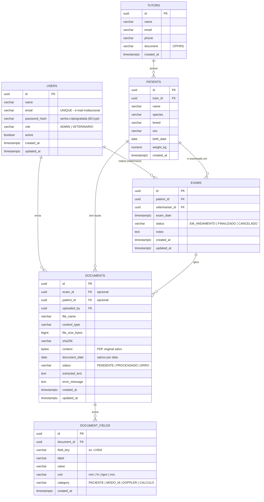

# CardioVet — Modelo Entidade-Relacionamento (MER)

Banco: **PostgreSQL 16**. Chaves primárias em `UUID` (`gen_random_uuid()`),
carimbos de tempo em `TIMESTAMPTZ`. O esquema é versionado por Flyway
(`backend/src/main/resources/db/migration`).

O diagrama abaixo está em **Mermaid** (`erDiagram`) — renderiza no GitHub, no
VS Code (extensão Mermaid) e em https://mermaid.live.

## Relacionamentos (cardinalidade)

| De | Para | Cardinalidade | Regra |
|----|------|---------------|-------|
| `tutors` | `patients` | 1 : N | Um tutor possui vários animais. |
| `patients` | `exams` | 1 : N | Um paciente realiza vários exames. |
| `users` | `exams` | 1 : N | O veterinário responsável pelo exame. |
| `users` | `documents` | 1 : N | Quem enviou o PDF (`uploaded_by`). |
| `patients` | `documents` | 1 : N | Laudos vinculados a um animal (opcional). |
| `exams` | `documents` | 1 : N | PDF gerado por um exame (opcional). |
| `documents` | `document_fields` | 1 : N | Pares rótulo/valor extraídos do PDF. |

## Tabelas centrais do requisito

- **`users`** — tabela padrão de usuários: `name`, `email` institucional (único),
  `password_hash` (senha **criptografada com BCrypt** — ver `ApplicationConfig`/`AuthService`),
  `role`, `active` e auditoria (`created_at`/`updated_at`).
- **`documents`** — documentos salvos **por data** (`document_date`, indexada).
  Guarda o PDF original (`content` BYTEA), metadados, status de extração e o texto bruto.
- **`document_fields`** — informações **extraídas** do PDF no layout padrão
  (medidas de ecocardiografia), normalizadas em `field_key`/`value`/`unit`/`category`.

## DDL de referência

O esquema real é criado pelas migrações Flyway:

- `V1__init_schema.sql` — `users`, `tutors`, `patients`, `exams`.
- `V2__documents.sql` — `documents`, `document_fields`.
